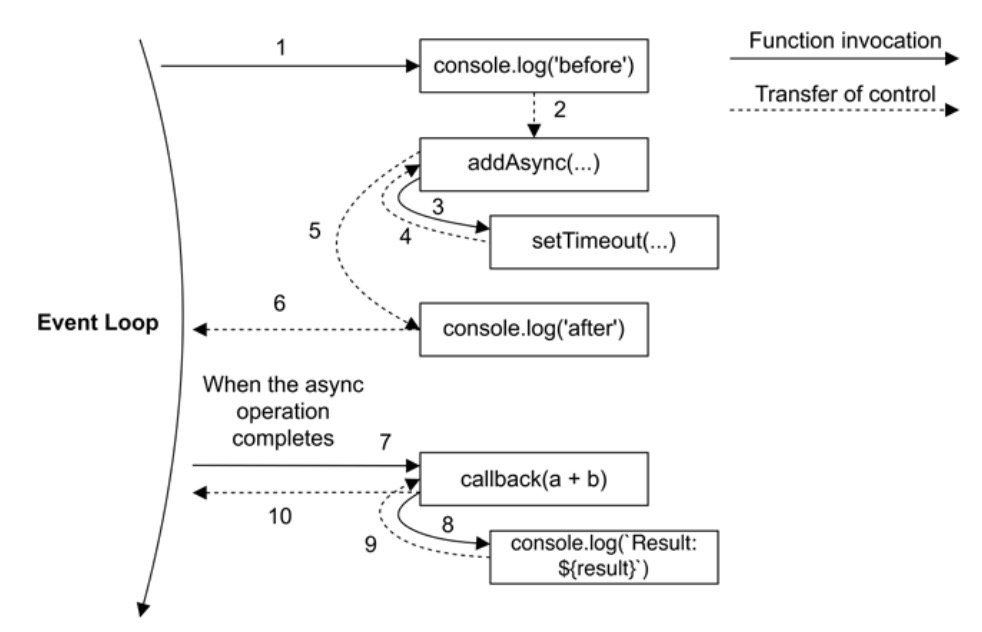

# Event loop

Event loop是异步编程的基础，Node.js通过Event loop实现了高性能非阻塞IO操作。了解Event loop，有助于了解程序背后的运行机制。本系列文章是我的学习总结，期间参考了一些很棒的资料，强烈推荐阅读。

## 参考资料

1. [What the heck is the event loop anyway?](https://www.youtube.com/watch?v=8aGhZQkoFbQ)
2. [Event Loop and the Big Picture — NodeJS Event Loop](https://blog.insiderattack.net/event-loop-and-the-big-picture-nodejs-event-loop-part-1-1cb67a182810)
3. [Node.js Design Patterns](https://www.nodejsdesignpatterns.com/)
4. [event-loop-timers-and-nexttick](https://nodejs.org/en/docs/guides/event-loop-timers-and-nexttick/)

## 准备工具

### Node.js

Node.js® is a JavaScript runtime built on Chrome's V8 JavaScript engine.

为了方便使用多版本Node.js，可以用 [nvm](https://github.com/nvm-sh/nvm)安装node。

```
curl -o- https://raw.githubusercontent.com/nvm-sh/nvm/v0.37.2/install.sh | bash
nvm install node
```

### V8

V8 is Google’s open source high-performance JavaScript and WebAssembly engine, written in C++. It is used in Chrome and in Node.js, among others.

有时候，我们想用V8直接运行JavaScript代码，所以建议独立安装一个V8程序。不过自己编译V8费时费力，可以使用 [jsvu](https://github.com/GoogleChromeLabs/jsvu) 安装各种平台下的JavaScript引擎（不限于V8）

```
npm install jsvu -g
jsvu --os=mac64 --engines=v8-debug
~/jsvu/v8-debug --help
```


#### Runtime vs Engine

从Node.js和V8官方介绍可以看出，Node.js是JavaScript runtime，V8是JavaScript engine。


engine负责JavaScript代码的执行，可能是解释执行，也可能通过 [JIT](https://en.wikipedia.org/wiki/Just-in-time_compilation) 技术，将JavaScript编译成机器代码执行。runtime使用engine，并增加额外的功能，甚至很多功能跟JavaScript无关，比如浏览器也是JavaScript runtime。熟悉Java的同学可以用JVM/JRE来类比。


V8只支持ECMAScript规范的JavaScript，像console.log/setTimeout并不属于ECMAScript规范，是由runtime实现的。[Event loop](https://developer.mozilla.org/en-US/docs/Web/JavaScript/EventLoop)也不属于ECMAScript规范，也需要由runtime来实现。


事实上，ECMAScript规范定义async/await/Promise这些异步编程的关键字/对象的行为，V8为了支持这些规范，内部也有简化版的Event lopp实现。但是为了性能等原因，runtime都会自己实现Event loop。

## 什么是Event loop

我们从一个简化的流程来看下什么是Event loop。（该例子来自于[Node.js Design Patterns](https://www.nodejsdesignpatterns.com/)这本书）

```javascript
function addAsync (a, b, callback) {
  setTimeout(() => callback(a + b), 100)
}

console.log('before')
addAsync(1, 2, result => console.log(`Result: ${result}`))
console.log('after')
```
将上面的代码保存到test.js文件，执行node test.js或v8-debug test.js，输出结果为

```
before
after
Result: 3
```


> 实线代表函数调用，虚线代表控制权转移

执行流程如上图所示，

1. console.log('before')进入调用栈运行，打印 before
2. addAsync(1, 2, ...)进入调用栈运行
3. addAsync调用了setTimeout这个异步函数
4. setTimeout是异步函数，还未执行内部代码，而是立即返回，回到addAsync调用栈
5. addAsync函数内没有其他代码，addAsync调用结束
6. console.log('after')进入调用栈运行，打印 after
7. 当前调用栈完成，进入Event loop。setTimeout等待时间已到，callback(1 + 2)函数进入调用栈
8. callback调用console.log(Result: ...)，打印 Result: 3
9. console.log执行完成，回到callback调用栈
10. callback函数内没有其他代码，callback调用结束，再次进入Event loop

当程序运行到setTimeout，并不是同步等待，而是立即返回，接着往下执行。最后一行代码执行后，程序不是立即退出，而是等待异步函数触发，并执行回调函数。这背后就是Event loop的运行逻辑。
本文主要对Event loop做个简单介绍，下一篇将详细讲解Node.js的Event loop机制。

