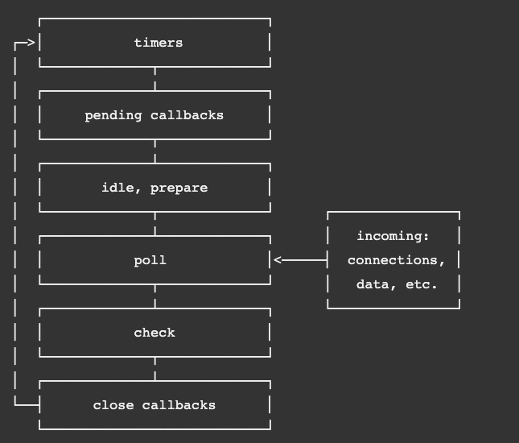
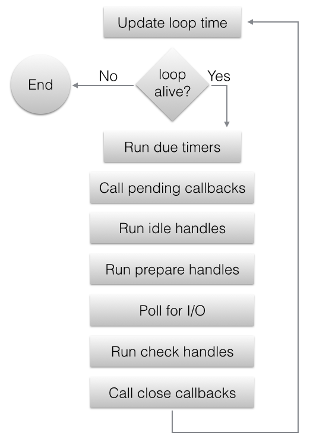
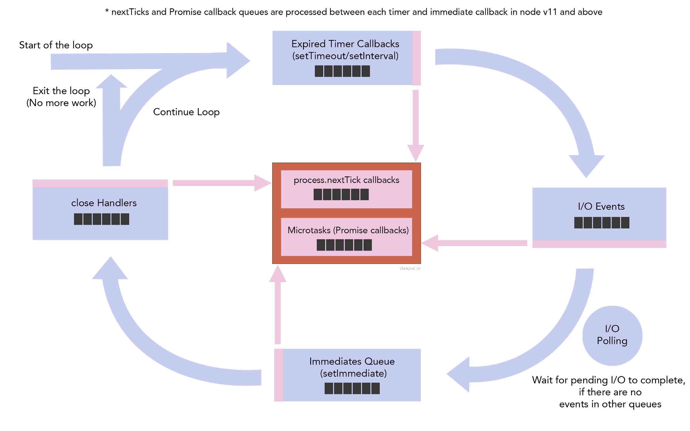

event loop通常联合[Reactor设计模式](https://en.wikipedia.org/wiki/Reactor_pattern)一起使用。在Node.js中每个异步IO操作都对应一个handler（也叫回调函数/callback）。当IO操作触发事件，相应的回调函数进入执行队列，event loop从队列中取出callback执行。event loop是单线程的，所以callback要尽量轻量。


## Node.js

Node.js进程启动后，先初始化event loop，再执行JavaScript文件，之后通过event loop循环执行异步操作的callbacks。在Node.js里，event loop分为多个阶段（phase），如下图所示



每个phase都有一个队列，存放该phase需要执行的callbacks。每个phase的说明可以参考[Node.js官方文档](https://nodejs.org/en/docs/guides/event-loop-timers-and-nexttick/)，解释得比较详细了。

## libuv

libuv is a multi-platform support library with a focus on asynchronous I/O. It was primarily developed for use by Node.js, but it’s also used by Luvit, Julia, pyuv, and others.

实际上，Node.js的event loop依赖[libuv](https://github.com/libuv/libuv)实现，可以通过libuv了解更底层的实现。

event loop可以说是libuv的核心部分，在libuv也可以看到跟Node.js一样的phase



从libuv的[代码](https://github.com/libuv/libuv/blob/v1.x/src/unix/core.c)，可以看到event loop的执行流程。

```c
int uv_run(uv_loop_t* loop, uv_run_mode mode) {
  int timeout;
  int r;
  int ran_pending;

  r = uv__loop_alive(loop);
  if (!r)
    uv__update_time(loop);

  while (r != 0 && loop->stop_flag == 0) {
    uv__update_time(loop);
    uv__run_timers(loop);
    ran_pending = uv__run_pending(loop);
    uv__run_idle(loop);
    uv__run_prepare(loop);

    timeout = 0;
    if ((mode == UV_RUN_ONCE && !ran_pending) || mode == UV_RUN_DEFAULT)
      timeout = uv_backend_timeout(loop);

    uv__io_poll(loop, timeout);

    /* Run one final update on the provider_idle_time in case uv__io_poll
     * returned because the timeout expired, but no events were received. This
     * call will be ignored if the provider_entry_time was either never set (if
     * the timeout == 0) or was already updated b/c an event was received.
     */
    uv__metrics_update_idle_time(loop);

    uv__run_check(loop);
    uv__run_closing_handles(loop);

    if (mode == UV_RUN_ONCE) {
      /* UV_RUN_ONCE implies forward progress: at least one callback must have
       * been invoked when it returns. uv__io_poll() can return without doing
       * I/O (meaning: no callbacks) when its timeout expires - which means we
       * have pending timers that satisfy the forward progress constraint.
       *
       * UV_RUN_NOWAIT makes no guarantees about progress so it's omitted from
       * the check.
       */
      uv__update_time(loop);
      uv__run_timers(loop);
    }

    r = uv__loop_alive(loop);
    if (mode == UV_RUN_ONCE || mode == UV_RUN_NOWAIT)
      break;
  }

  /* The if statement lets gcc compile it to a conditional store. Avoids
   * dirtying a cache line.
   */
  if (loop->stop_flag != 0)
    loop->stop_flag = 0;

  return r;
}
```

从代码中可以看到，依次调用了

- uv__run_timers(loop)
- uv__run_pending(loop)
- uv__run_idle(loop)
- uv__run_prepare(loop)
- uv__io_poll(loop, timeout)
- uv__run_check(loop)
- uv__run_closing_handles(loop)

当然，event loop是一种设计模式的组成部分，并未规定实现方式，这个只是libuv/Node.js的实现方式。作为使用者，多数情况下也不必全部了解这些phase，可以适当简化，更容易理解JavaScript代码的执行顺序。

我们可以通过下图更清晰地了解Node.js event loop的执行流程。（以下图片和例子都来自[这篇文章](https://blog.insiderattack.net/handling-io-nodejs-event-loop-part-4-418062f917d1)）

[](https://blog.insiderattack.net/event-loop-and-the-big-picture-nodejs-event-loop-part-1-1cb67a182810)

大家可以先运行下这个代码，看是否知道执行结果。

```javascript
Promise.resolve().then(() => console.log('promise1 resolved'));
Promise.resolve().then(() => console.log('promise2 resolved'));
Promise.resolve().then(() => {
    console.log('promise3 resolved');
    process.nextTick(() => console.log('next tick inside promise resolve handler'));
});
Promise.resolve().then(() => console.log('promise4 resolved'));
Promise.resolve().then(() => console.log('promise5 resolved'));
setImmediate(() => console.log('set immediate1'));
setImmediate(() => console.log('set immediate2'));

process.nextTick(() => console.log('next tick1'));
process.nextTick(() => console.log('next tick2'));
process.nextTick(() => console.log('next tick3'));

setTimeout(() => console.log('set timeout'), 0);
setImmediate(() => console.log('set immediate3'));
setImmediate(() => console.log('set immediate4'));
```

even loop开始后，依次进入每个phase，开始从当前phase获取callbacks前，如果process.nextTick callbacks和Promise callbacks不为空，先执行这两个队列的callbacks，再执行当前phase的callbacks，然后进入下一个phase。

>process.nextTick是Node.js提供的功能，在event loop开始前，或每个phase开始前，如果存在process.nextTick callbacks，会先执行process.nextTick callbacks。

我们运行上面的代码，得到如下结果

```
next tick1
next tick2
next tick3
promise1 resolved
promise2 resolved
promise3 resolved
promise4 resolved
promise5 resolved
next tick inside promise resolve handler
set timeout
set immediate1
set immediate2
set immediate3
set immediate4
```

1. 先执行 process.nextTick callbacks
2. 然后执行 Promise callbacks
3. 第3个Promise callback调用了process.nextTick，当Promise callbacks全部执行完，优先执行process.nextTick callback
4. 执行 timers phase callbacks
5. 执行 check phase callbacks

